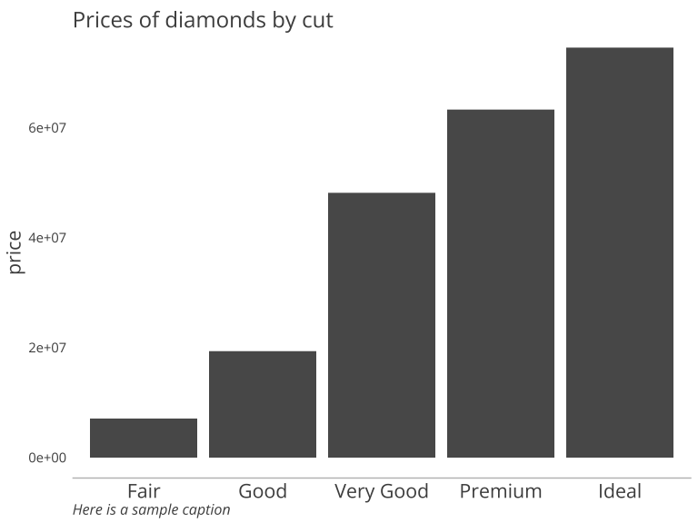
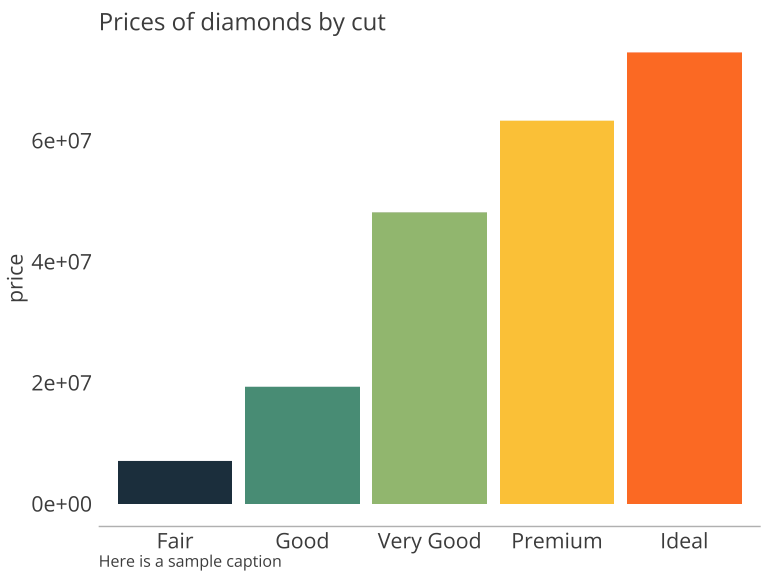
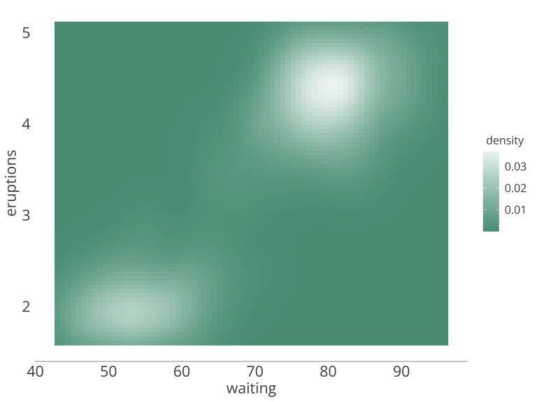

```r
library(ggplot2)
library(tidyverse)
```

### Installation

This is a brief guide to using the `TPLthemeR` package, which provides themes and colors for customizing ggplot visualizations using TPL's style guide. 

The package can be installed to your R library directly from GitHub using the following commands in RStudio:


```r
install.packages("devtools") #devtools allows installation directly from github; only run this command if you do not already have devtools installed

devtools::install_github("heidiwallace/TPLthemeR") #install the package to your R library
```


```r
library(TPLthemeR) #load the library
```

<br>

Note: If you run into trouble installing the `devtools` package, you may need to download Xcode (on Mac) or Rtools (on Windows) first. See <a href="https://www.r-project.org/nosvn/pandoc/devtools.html">here</a> for more details or feel free to contact me for troubleshooting! 

<br><br>

### Plot layers

The package currently provides three custom themes that can be added to ggplot visualizations in the same way that `ggplot2`'s built-in themes are layered onto plots. The custom themes are `theme_tpl()`, `theme_tpl_legend_top()`, and `theme_tpl_legend_right()`.

`theme_tpl()` customizes the plot grid and fonts. It does not provide any customization for legends, though additional customization can be layered on manually. The additional themes called `theme_tpl_legend_top()`, and `theme_tpl_legend_right()` provide customized settings for legends placed either at the top of the plot (underneath the plot title) or to the right of the chart.


```r
#plot with default ggplot2 theme
p <- 
  diamonds %>% 
  ggplot(aes(cut, price)) +
  geom_col() +
  labs(title = "Prices of diamonds by cut",
       caption = "Here is a sample caption")

p
```

<!-- -->


```r
#plot with custom TPL theme
p + theme_tpl()
```

<!-- -->


<br><br>

### Setting colors using plot layers

The package also provides four built-in functions called `scale_fill_discrete_tpl()`, `scale_fill_continuous_tpl()`, `scale_color_discrete_tpl()`, and `scale_color_continuous_tpl()`. These can be layered on to plots to provide branded coloring. These functions work just like the built-in `ggplot` functions `scale_fill_discrete()`,  `scale_fill_continuous()`, `scale_color_discrete()`, and `scale_color_continuous()`, and they accept the same arguments as the built-in functions. 

See `?scale_fill_continuous_tpl` and `?scale_color_continuous_tpl` for the two additional arguments that these functions require.

Note also that the `theme_tpl()` function can be used in conjunction with typical `theme()` layers. If you wish to override any settings in `theme_tpl()`, `theme()` must follow the `theme_tpl()` layer.


```r
#example with discrete colors

diamonds %>% 
  ggplot(aes(cut, price, fill = cut)) +
  geom_col() +
  labs(title = "Prices of diamonds by cut",
       caption = "Here is a sample caption") + 
  scale_fill_discrete_tpl() +
  theme_tpl() +
  theme(legend.position = "none")
```

<!-- -->

<br><br>


```r
#example with continuous colors

g <- 
  ggplot(faithfuld, aes(waiting, eruptions, fill = density)) +
  geom_tile()

g + 
  theme_tpl_legend_right() +
  scale_fill_continuous_tpl('teal', reverse = T)
```

<!-- -->

<br><br>

### Setting colors manually

TPL colors can also be called using the function `tpl_colors()`. This function creates a vector of named color hex codes. The colors and their codes are shown below.

<!-- -->

<br><br>

A use case for this function is setting a single color or set of colors in a plot.


```r
#create a vector of color hex codes
colors <- tpl_colors()

#plot using a hex code from the vector
diamonds %>% 
  ggplot(aes(cut, price)) +
  geom_col(fill = colors[['orange']]) +
  labs(title = "Prices of diamonds by cut",
       caption = "Here is a sample caption") +
  theme_tpl()
```

<!-- -->


### References

* <a href="http://rpubs.com/mclaire19/ggplot2-custom-themes">Learning to create custom themes in ggplot</a>

* <a href="https://drsimonj.svbtle.com/creating-corporate-colour-palettes-for-ggplot2">Creating corporate colour palettes for ggplot2</a>

* <a href="https://tinyheero.github.io/jekyll/update/2015/07/26/making-your-first-R-package.html">Making your first R package</a>
